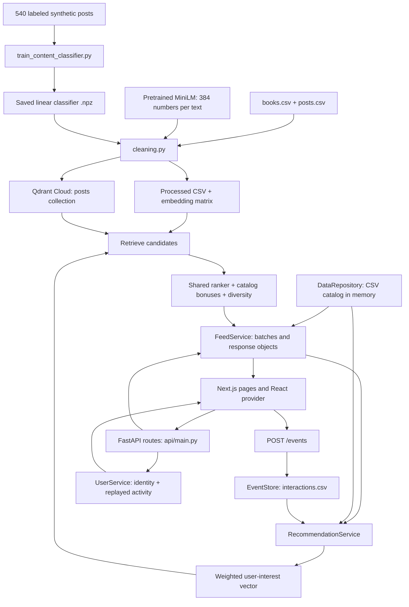

# BookFeed architecture

This describes the actual project after the readability rewrite. The website,
API paths, ranking formulas, data formats, and separate Streamlit interface are
preserved. The project is a content-based recommender with hand-written ranking
rules. It is not collaborative filtering and does not train MiniLM after clicks.

## 1. The complete system



The main runtime has two processes: Next.js, normally on port 3000, and Uvicorn /
FastAPI, normally on port 8000. Qdrant is an optional external vector database.
CSV files store the application data. There is no SQL database, Redis, background
job system, separate model server, or Next.js backend API.

## 2. File map and responsibilities

| Location | Responsibility |
| --- | --- |
| `frontend/src/app/` | URLs and page layouts |
| `frontend/src/components/` | Cards, feed, reading view, navigation, inspector |
| `frontend/src/providers/bookfeed-provider.tsx` | Shared user/feed state and user actions |
| `frontend/src/services/api.ts` | Fetch requests, API base URL, browser session ID |
| `frontend/src/services/contracts.ts` | Explicit TypeScript shapes of backend JSON responses |
| `frontend/src/services/feed.ts` | Feed/search/catalog/post requests; API-to-UI mapping |
| `frontend/src/services/users.ts` | User profile request and mapping |
| `frontend/src/services/events.ts` | Event delivery, local history, failed-event queue |
| `frontend/src/types/index.ts` | TypeScript shapes used by the UI |
| `frontend/src/app/globals.css` | Visual design and common styles |
| `frontend/public/book-covers/` | Local covers and default placeholder |
| `api/main.py` | Construct services, configure CORS, expose HTTP routes |
| `api/config.py` | Paths, origins, Cloud settings, test options |
| `api/schemas.py` | Pydantic request validation and response shapes |
| `api/services/data_service.py` | Read catalog; map rows; search books; append posts |
| `api/services/event_service.py` | Append/deduplicate events; rebuild activity state |
| `api/services/user_service.py` | Combine identity, profile posts, saved/liked items |
| `api/services/feed_service.py` | Pagination, ranked response mapping, direct items |
| `api/services/recommendation_service.py` | Website interests, retrieval, bonuses, diversity, debug |
| `generate_recommendations.py` | Shared feature scoring, Cloud search, genre expansion, feed selection |
| `genre_taxonomy.py` | 40 genre profiles, keywords, and neighboring genres |
| `embedding_model.py` | Load pretrained `all-MiniLM-L6-v2`, preferring cached files |
| `cleaning.py` | Filter posts, embed/classify them, save cache, optionally upload |
| `content_classifier.py` | Text-intent features and portable linear classifier inference |
| `train_content_classifier.py` | Grouped splits, classifier training, metrics/artifacts |
| `personalization.py` | Vector normalization plus Streamlit book profiles and feedback learning |
| `app.py` | Older standalone Streamlit UI |
| `scripts/check_qdrant.py` | Read-only Cloud connection check |
| `scripts/evaluate_personalization.py` | Controlled before/after ranking evaluation with temporary events |
| `scripts/fetch_book_covers.py` | Optional Open Library cover download/cache |
| `tests/` | Cleaning, classification, personalization, ranking, and API checks |
| `requirements.txt` / `frontend/package.json` | Python / JavaScript dependencies |

Empty `__init__.py` files make Python directories importable packages. Next.js,
TypeScript, ESLint, and PostCSS config files configure the frontend toolchain.
Environment examples document settings; real environment files remain private.

## 3. Stored data

Counts below are from the supplied dataset at inspection time. Running the product
can add posts and events.

| File | Contents and purpose |
| --- | --- |
| `data/books.csv` | 350 books: `book_id,title,author,genre,description` |
| `data/posts.csv` | 4,000 posts; 3,680 book-related and 320 off-topic |
| `data/users.csv` | Demo identity metadata; website defaults to user `1` |
| `data/interactions.csv` | Append-only website activity; ignored by Git |
| `data/posts_processed.csv` | 3,680 cleaned/classified/enriched posts; generated |
| `data/post_embeddings.npy` | Float32 matrix shaped `(3680, 384)`; generated |
| `data/labelled_posts_training.csv` | 540 labeled examples, 180 per class |
| `data/labelled_posts_training.xlsx` | Readable training-data workbook |
| `models/content_classifier.npz` | Class names, linear weights/bias, model metadata |
| `models/content_classifier_metrics.json` | Saved train/validation/test counts and metrics |
| `models/content_classifier_test_predictions.csv` | Saved held-out predictions for inspection |

A raw post stores `post_id,user_id,nickname,book_id,content,published_at,view_count,
like_count,comment_count,repost_count,is_book_related,writing_style,content_length`.
The processed file adds word count, content type, classification confidence/margin,
and book title. Row `i` in the processed CSV corresponds to row `i` in the embedding
matrix. Both must be regenerated together. The API checks their row counts.

Each Qdrant point stores a post ID, its 384-dimensional vector, and a payload with
post text, book metadata, content type, length, timestamp, and engagement counts.
The local catalog remains the source for the frontend post/book display objects.

Each website event stores an ID, user, type, post/book/query target, UTC timestamp,
session ID, feed-request ID, displayed rank, recommendation score, and optional
reading-time measurements. This allows later analysis of what was shown and what
the reader did. No learned ranking model currently consumes that log for training.

## 4. Offline preparation and classifier training

Preparation happens before serving recommendations:

1. Read raw posts and keep rows marked book-related.
2. Remove short posts, repetitive text, and duplicates. Current thresholds are at
   least 8 words, at least 6 unique words, and less than 65% generic words.
3. Attach book titles using `book_id`.
4. Encode each post's text with MiniLM and normalize the vector to length one.
5. Classify each post as review, discussion, or recommendation.
6. Save the processed CSV and embedding matrix.
7. Unless `--skip-qdrant` is supplied, replace/upload the Cloud `posts` collection.

MiniLM is a pretrained sentence encoder. Training code keeps those embeddings
fixed and trains a multinomial logistic-regression classifier on 392 inputs:
384 embedding values plus 8 text features. These features check recommendation
intent, discussion intent, a question mark, reader-directed language, evaluation
language, first person, word count, and a specific rhetorical-question pattern.

Training groups examples by book so one book cannot occur in multiple splits.
The saved artifact uses 386 training, 77 validation, and 77 test rows. Several
regularization strengths are tried; validation macro-F1 selects one. Inference
also requires explicit recommendation intent before labeling a post a
recommendation. The classifier does not choose which posts match a user.

The saved metrics report 1.0 validation/test accuracy and macro-F1. These are
historical results on a small synthetic dataset, not independently established
real-world performance. The supplied processed catalog contains 3,267 reviews,
413 discussions, and no recommendations; recommendation examples were generated
separately for classifier training.

## 5. One feed request, step by step

The useful code-reading entry point is `RecommendationService.recommend()`.

1. Browser requests `GET /feed/1?limit=10&session_id=...`.
2. The route verifies the demo user exists.
3. `FeedService` decodes the cursor into IDs already returned. On an initial request,
   it also excludes posts impressed in the same session.
4. `RecommendationService` loads the user's event history and builds interests.
5. Previously returned and not-interested IDs are excluded.
6. Retrieve extra candidates: the requested candidate target is `max(limit * 3, 30)`.
7. Apply the shared ranker, then catalog bonuses and book/author diversity.
8. `FeedService` joins each selected post to its book, adds scores/reasons/rank,
   and returns a batch, next cursor, request ID, and debug information.
9. The browser appends the batch without changing the order of visible posts.

The cursor is URL-safe Base64 containing JSON with a set of already-returned IDs.
It is a pagination value, not authentication or encryption. Ranking is recalculated
for each next batch, so new actions can affect later results.

A feed item has five parts:

```text
post             ID, text, reader name, date, counts, content type, word count
book             ID, title, author, genres, description, local cover path
signals          similarity, affinities, freshness, popularity, final score, reason
rank             position within this response batch
feed_request_id  identifier linking later events to this batch
```

## 6. How the website builds interests

For each useful event, build text from the associated book metadata plus post
content. Search text can be expanded with matching catalog descriptions. Encode
that text and multiply its vector by the event's weight.

| Action | Weight |
| --- | ---: |
| Post click | 0.25 |
| Fully read post | Up to 0.65 |
| Book open | 0.40 |
| Search | 0.55 |
| Like / unlike | 0.80 / -0.80 |
| Save / unsave | 1.00 / -1.00 |
| Comment | 0.60 |
| Follow author | 0.75 |
| Not interested | -0.90 |
| Impression | 0.00 |

A weighted vector sum points toward positive interests and away from negative
ones. Normalize the sum to length one. Keep up to the last 120 events in each
history/session vector calculation.

For older-session activity, combine a general-books vector with 0.35 times the
normalized event direction, then normalize again. For the current session, use
its event direction. When both are available:

```text
user vector = normalize(0.55 × older-interest vector + 0.45 × session vector)
```

If the current session contains a search, the mix becomes 0.35 older / 0.65 current.
With no activity, use the general-books vector. Metadata terms come from the last
80 positive events, or general-book terms when there are none.

Reading time is foreground-tab time in the post reading view. Opens shorter than
2 seconds do not produce a reading event. Expected duration is word count divided
by 225 words/minute, rounded to milliseconds, with a minimum of 4 seconds. The
logged ratio is capped at 3; the ratio used for weighting is capped at 1, so the
resulting read weight is at most 0.65:

```text
reading ratio = dwell milliseconds / expected reading milliseconds
read weight = 0.65 × min(reading ratio, 1)
```

These updates recompute a profile vector. They do not retrain MiniLM or fit a new
website ranking model after each interaction.

## 7. Candidate retrieval and ranking

### Retrieval modes

- **Qdrant Cloud:** search by cosine similarity to the user vector, initially using
  a 0.45 threshold. If too few posts survive, find the two closest genre profiles,
  then explore neighboring genres at levels 1, 2, and 3 with thresholds 0.40, 0.34,
  and 0.28. Finally search a general-books vector without a threshold if needed.
- **Cached embeddings:** multiply the normalized post matrix by the normalized
  query vector to get cosine similarities. Take an extra window of candidates,
  remove blocked IDs, then apply the shared scoring/selection code. This path does
  not traverse the Cloud genre-search graph.
- **CSV fallback:** if a usable local vector index is absent, use related raw posts
  with a fixed 0.25 similarity and the remaining ranking rules. Tests can also
  disable embeddings explicitly.

Thus Cloud and cached retrieval preserve the same product flow and scoring rules,
but can return different candidate sets. `/health` reports the configured mode;
the feed's debug snapshot records the mode actually used for that request.

### Scores and ordering

The base ranker uses:

```text
score = 0.60 × semantic similarity
      + 0.12 × exact term match
      + 0.10 × freshness
      + 0.08 × like rate
      + 0.04 × length
      + 0.03 × comment rate
      + 0.03 × normalized log views
```

Exact matching looks for whole words/phrases in the post and saturates at two
matches. Freshness is `1 / (1 + age_hours / 168)`. Like/comment rates divide by views
and cap at one. Length caps at 100 words. Views use `log(1 + views)`, scaled against
the largest value in that candidate set.

There are **two ordering stages**, which matters when explaining the code:

1. Shared `build_feed()` selects candidates by topic level, then type (review,
   discussion, recommendation), then longer text, then weighted score.
2. The website adds catalog bonuses to this selected pool and sorts by topic level,
   final score, and similarity. Author match adds 0.10, title match 0.07, category
   match 0.04, with the combined bonus capped at 0.14 and the final score at 1.

Finally, the website prefers at most two posts per book and three per author.
Posts deferred by those limits may fill the batch if there are too few alternatives.
This is a deliberate heuristic pipeline, not a single globally learned score.

## 8. Frontend, events, and persistence

The React provider loads the feed, user profile, and catalog and exposes them to
pages. Service functions translate Python's snake_case response fields into the
camelCase fields used by React.

| Page | Main behavior |
| --- | --- |
| `/` | Redirect into the app |
| `/home` | Personalized feed, refresh, infinite scroll |
| `/explore` | Search posts and catalog books |
| `/saved` | Saved posts reconstructed from events |
| `/create` | Choose a book and publish a short post |
| `/profile` | Own, saved, liked posts and demo identity |
| `/onboarding` | Choose interests; record them as search events |
| `/post/[postId]` | Refreshable full reading view |
| `/debug` | Inspect profile signals, candidates, ranking and timings |

Two IntersectionObservers handle pagination and impressions. A feed sentinel
requests another batch near the bottom. A post needs to be at least half visible
briefly to record an impression. The event service keeps browser history, sends
events in sequence, and retains failed events for a later retry. Before fetching
another batch, the provider waits for queued delivery work.

An event route checks its target and appends one row. Duplicate event IDs and
repeated impressions for the same user/session/batch/post do not add rows. Likes
and saves are reconstructed by replaying like/unlike and save/unsave in order.
A simple thread lock prevents simultaneous requests in one API process from
interleaving CSV operations. The rewrite removed operating-system file-lock
plumbing; multiple worker processes writing these files are outside this demo's
supported setup.

## 9. Backend API reference

The existing backend is `api/main.py`; automatic docs are served at `/docs` and
`/openapi.json` when Uvicorn is running.

| Request | Input | Result |
| --- | --- | --- |
| `GET /health` | None | Status, catalog counts, mode, whether Cloud is configured |
| `GET /health/qdrant` | None | Configured/connected, collection name and point count |
| `GET /feed/{user_id}` | `limit` 1–50, optional cursor, session ID | Posts, cursor, has_more, request ID, debug |
| `POST /events` | Validated event JSON | Success, stored event ID, duplicate flag, profile version |
| `GET /users/{user_id}` | User ID | Identity, posts, saved/liked/hidden/followed IDs and recent events |
| `POST /posts` | User ID, book ID, text 1–320 characters | Saved post/book item |
| `GET /posts/{post_id}` | Post ID | Direct post/book item |
| `GET /search` | `q`, user/session IDs, `limit` 1–50 | Ranked posts and matching books |
| `GET /books` | Optional `q`, `limit` 1–350 | Catalog books matching title/author/genre/description |
| `GET /recommendations/{user_id}/debug` | User ID | Last in-memory recommendation snapshot |

Search uses a query vector instead of the normal profile vector. `GET /search`
does not save an event itself; the frontend sends `POST /events` separately so
that search can also influence later feeds.

## 10. The separate Streamlit and command-line paths

`app.py` talks directly to Qdrant and the shared Python functions. It does not call
FastAPI. A reader selects read/interested books; `personalization.py` averages book
vectors with weights 1.0 for read and 0.8 for saved/interested.

Streamlit feedback can update one preference vector with PyTorch when both liked
and disliked examples exist. With only one feedback class it uses a centroid
update. This small optional feedback learner is separate from website event-based
personalization and from the content-type classifier.

Streamlit uses `data/user_book_events.csv` and `data/interaction_events.csv`.
The website uses `data/interactions.csv`. They do not share a live user profile.

The legacy executable in `generate_recommendations.py` expects
`data/user_events.csv`, which is absent from this checkout. It is not needed by
the website or Streamlit. The reusable functions in that file are still central.

## 11. Current product limits and checks

These are relevant facts about the existing product:

- One configured demo identity; no sign-in, authorization, or real social graph.
- Comment buttons record an event; there is no stored comment body or comment API.
- The website's trending section uses catalog entries, not a computed trend model.
- New posts appear in profile/detail immediately. They enter the vector index only
  after cleaning/upload and an API restart, if they pass cleaning rules.
- Engagement displayed in posts comes from synthetic catalog counts; event logging
  does not rewrite those catalog counters globally.
- Recommendation debug snapshots and profile-version counters are in memory and
  reset on restart. User metadata also has its own CSV profile-version field.
- The index and catalog are loaded/cached in memory; external file edits require a
  restart. Event reads scan the CSV. This favors understandable local code over
  high-volume deployment.
- Cursors grow with seen IDs, and has_more is based on catalog counts. Near the end
  of a heavily filtered feed, an extra request can return no posts.

Verification includes unit tests for cleaning, classifier intent, profile changes,
ranking rules, and API behavior, plus a real MiniLM/cached-index personalization
experiment. API tests use temporary post and event files. Frontend lint and build
check React/TypeScript integration. Existing source was preserved under
`/private/tmp/bookfeed-before-simplification` before edits; Git's existing working
changes were treated as the starting point rather than discarded.
